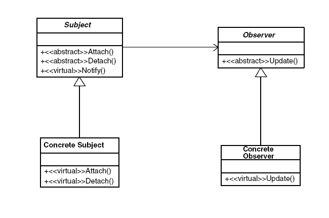
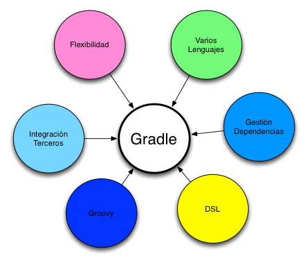

#TAREA 04 "INVESTIGACIÓN DE CONCEPTOS"#

##¿Qué es un patrón de diseño?##

Son la base para la búsqueda de solución de problemas en desarrollo de software.  
Brindan una solución ya probada y documentada a problemas de desarrollo de software que  
pueden tener caracteristicas similares a algún problema que se se presente para un  
desarrollador.

Los elementos más importantes en un patrón de diseño son el nombre, el problema  
(cuando aplicar un patrón), la solución(descripción abstracta del problema), consecuencias  
(costos y beneficios).

Clasificación de los patrones:

-Patrones creacionales: Inicialización y configuracion de objetos.
-Patrones estructurales: Separan la interfaz de la implementación.
-Patrones de comportamiento: Describen la comunicación en tre clases y objetos.

A continuación el siguiente diagrama muestra un ejemplo de un patrón en particular,  
el patrón observer.

##Patrón Singleton##

Restringe la instanciación de una clase o valor de un tipo a un solo objeto. Consiste  
en implementar un método que crea una instancia de un objeto, si y solo si no existe ya otra  
instancia.

##Patrón Factory Method##

Parte del principio de que las subclases determinan la clase a implementar. Permite  
definir objetos que no le corresponde decidir cual sera su uso final, esta decisión le  
corresponde  a las subclases.

##Patrón Builder##
	
Nos permite separar la construcción de un objeto de su representacion, con el fin de  
poder usar el proceso de construcción para diferentes representaciones.  

##Patrón Adapter##

Convierte una interfaz en otra.

##Patrón Flyweight##

Elimina la redundancia o la reduce cuando tenemos una gran cantidada de objetos con  
informacón identica.

##Patrón Iterator##

Define una interfaz que declara los métodos necesarios para acceder a una colección  
de objetos sin revelar su estructura interna. 

##Patrón Observer##
	
Notifca los cambios que se le hayan hecho a un objeto.

##¿Qué es la herramienta ADB en Android?##

ADB(Android Debug Bridge), es una herramienta que nos permite interactuar con nuestro  
dispositivo Android desde un oredenador. Esta herramienta nos permite mandar instrucciones a  
nuestro telefono desde el ordenador, tales como copias de archivos desde el ordenador al  
teléfono e inicializar en modo recovery. ADB nos permite cambiar el software de nuestro  
dispositivo con la ayuda de un USB. El ADB es indispensable para desarrollar software  
para android.

##Operador final en java##

El operador *final* nos permite crear variables que serán utilizadas durante todo  
el programa pero que no se desea cambiar su valor. En una método evita que dicho método  
sea redefinido por subclases. En una clase el operador final evita que se creen clases  
derivadas de  dicha clase.

##Lenguajes que soportan sobrecarga de operadores##

La sobrecarga de operadores nos permite redefinir un operador y realizar una operación  
que necesita hacer la llamada de un método con el uso de un operador. A continuación se muestra  
un ejemplo de como crear una sobre carga de operadores en C#.

public static Complex operator +(Complex c1, Complex c2)
{
	return new Complex(c1.real + c2.real, c1.imaginary + c2.imaginary);
}

Se puede ver que crear una sobrecarga de operadores es muy similar a crear un método. De  
tal manera que ya podriamos sumar números complejos tan solo usando el operador(+).

**Los Lenguajes que soportan sobre carga de operadores son:**
-C++
-C#
-Python

##Función de Gradle##

Gradle es un sistema de compilación que reune las mejores caracteristicas de otros sistemas  
de compilación(como ant ymaven). Esta basado en JVM(Java Virtual Machine) lo cual nos permite escribir  
nuestros propios scripts en java, con la seguridad de que Android los podra enteder e implementar.  
Gradle es un plugin, el cuál nos permite actualizar y exportar de un proyecto a otro.

Gradle es una herramienta de automatización y tiene como objetivo superar a sus sistemas base,  
es felxible y permite trabajar con más lenguajes. A continuación se muestra un diagrama de las bases  
que conforman Gradle. 

##Inyección de dependencias##

Es un patrón de diseño de software usado en la programación orientada a objetos, cuyo objetivo  
es facilitar la creación de objetos, haciendo esta mas practica, útil, escalable y mejor versatilidad  
en código. A diferencia de otros patrones, este se dedica a la creación de objetos unicamente.

